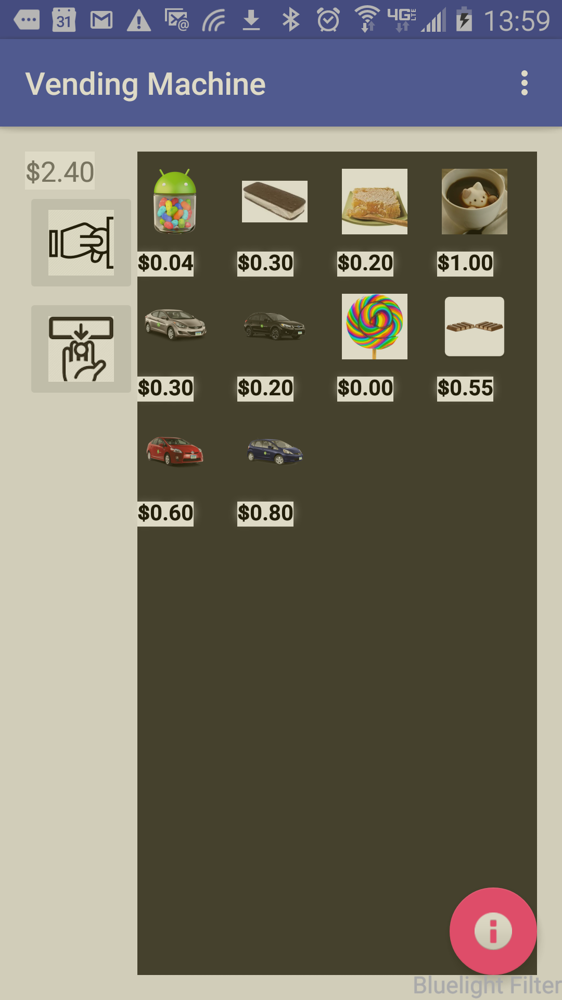
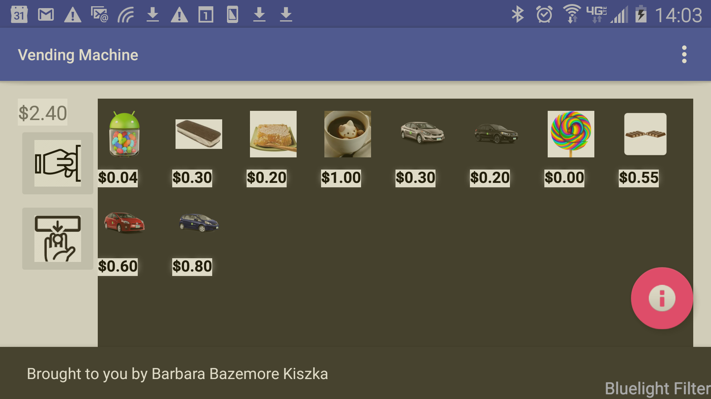

# VendingMachine
VendingMachine kata code exercise

This is a very basic VendingMachine application that will:
* display a selection of items like a vending machine
* allow you to enter "coins" to make a purchase
* click item to purchase
* click refund button to return change
* [TODO] restock the machine from Settings
Future:
* Allow user to define a set of coin values in the Settings
* Allow user to define the inventory restock amounts in the Settings

Techniques used
* Design patterns - MVC, Observer, EventBus, Parcelable Builder,
* Gridview + ArrayAdapter

